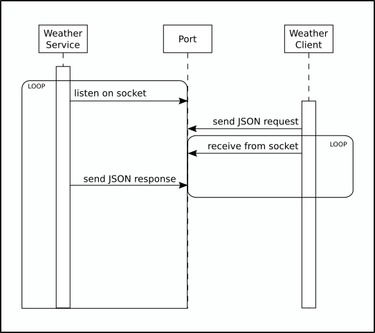

# weather package

This package communicates with several web-based APIs to deliver
weather data for US cities.

## GUI-based client

A GUI-based client is provided for use in standard desktop
environments. To execute from this directory use the command:

```python main.py```

The source of the GUI client can be found in the	
[`gui`](./gui/__init__.py) subdirectory of this directory.

## Use as a TCP server

This package includes the WeatherService class in the source file
[`weather/service.py`](./weather/service.py) which provides a simple
API for running a local weather service on your system. An example of
a server implementation is contained in
[`weather-service.py`](./weather-service.py). This implementation will
run the service on your localhost at a provided port number; if no
port number or an invalid port number is provided, the service will be
run on an arbitrarily-chosen non-priveleged port (and the port so
chosen will be printed to stderr).

### "Communication Contract" for TCP clients

The service accepts and responds with JSON-formatted data. An example
client is provided below, and an additional example is provided in
[`client-demo.py`](./client-demo.py).

Here is a UML sequence diagram:



#### Request format

* `request-type`: The value of this key conveys the type of data being
  requested. Currently, the only recognized value is
  `current-conditions` which returns the most recent weather
  conditions reported by the weather station.
* `city`: The name of a US city, town, village, etc. This, along with
  `state`, is used to find the nearest weather station.
* `state`: The name of a US state. This, along with `city`, is used to
   find the nearest weather station.

#### Response format

* `status`: This key is used to indicate if a problem was encountered
  during retrieval. If the value of this key is `ok`, then no problems
  were encountered. If the value of this key is not `ok`, its value
  will an error code.
* `response-type`: The value of this key matches the `request-type`
  value of the request which generated this response.
* `message`: The actual content of the response. In the case of an
  error, this will contain information about the error.

#### Example clients

In the following examples, we make use of the `encode` function
provided by [`weather/service.py`](./weather/service.py) which
transforms a Python dict object into a byte array of JSON-formatted
data for socket transmission. The `decode` function does the opposite.

##### Communicating with a local service

We can make use of the WeatherService class to retrieve information
about a local service; namely, the `host` and `port` properties
retrieve that information from the active service.

```
import socket
import weather.service as ws

request_dict = {
    'request-type':'current-conditions',
    'city': 'Cleveland',
    'state': 'Ohio'
}

payload = ws.encode(request_dict)
with socket.socket(socket.AF_INET, socket.SOCK_STREAM) as s:
    s.connect((server.host, server.port))
    s.sendall(payload)
    response = ws.decode(s.recv(1024))
print(response)
```

This would print something like:

```
{'status': 'ok', 'response-type': 'current-conditions', 'message': '47.0 ℉ (8.3 ℃) Fair'}
```

##### Communicating with a remote service

This is not substantially different from communicating with a local
service, however we cannot rely on the WeatherService class to provide
host a port information, which we'll need to know by other means.

```
import socket
import weather.service as ws

request_dict = {
    'request-type':'current-conditions',
    'city': 'Corvallis',
    'state': 'Oregon'
}

HOST = '192.168.5.23'
PORT = 49562
payload = ws.encode(request_dict)
with socket.socket(socket.AF_INET, socket.SOCK_STREAM) as s:
    s.connect((HOST, PORT))
    s.sendall(payload)
    response = ws.decode(s.recv(1024))
print(response)
```

This would print something like:

```
{'status': 'ok', 'response-type': 'current-conditions', 'message': '44.0 ℉ (6.7 ℃) Fog/Mist'}
```
